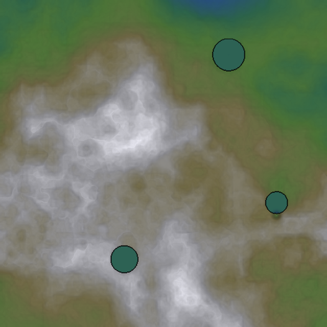
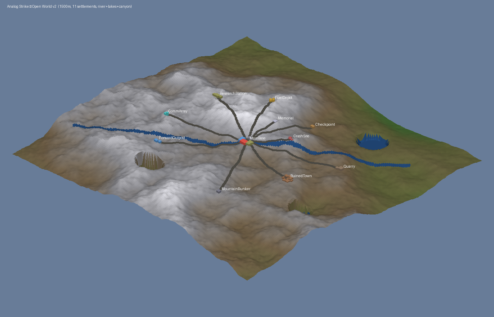

# Analog Strike

A third-person tactical shooter built in **Unreal Engine 5.7**. The premise: rogue robots control every digital system, so the player is a heavily-augmented operative who has to reclaim machine-controlled facilities using *physical* means only — no hacking, no AI assistance, no smart tech.

## Open-World Map (v3 — vast & organic)

The world is **procedurally generated** and no longer reads as a designed bowl — it's a continuous **1.5 km × 1.5 km** landscape where mountain ridges, foothills, valleys, and lowlands emerge organically from layered fractal + ridged noise. Mountains run in every direction with no artificial boundary; the 11 settlements sit on flat pads carved into the wider wilderness.


*Cyan = three lakes, blue line winds through = river, white = snow peaks, green = lowlands. Notice mountain chains continuing in every direction.*



**Terrain features:** 3 lakes, a meandering NW→SE river, two carved canyons, snow-capped peaks scattered organically, ridged mountain chains running in multiple directions.

## Previous iterations

<details>
<summary>v2 — 800 m mountain-ringed basin</summary>


</details>

### Settlements

| Settlement | Role |
| --- | --- |
| **Main Base** | Player spawn / hub. Command center + barracks + warehouses + motor pool. Walled. |
| **Forward Outpost** | Small recon position with a watchtower. |
| **Ruined Town** | Scattered partially-collapsed buildings — guerilla combat. |
| **Research Station** | Labs with antenna pillars; walled. |
| **Checkpoint** | Gatehouse on the south road. |
| **Mountain Bunker** | Fortified in the foothills. |
| **Quarry** *(new)* | Industrial site with a rock pile and equipment. |
| **Comm Array** *(new)* | Comms relay with three tall antenna stacks. |
| **Crash Site** *(new)* | Long downed-aircraft fuselage and debris trail. |
| **Fuel Depot** *(new)* | Four cylindrical fuel tanks ringed by a wall + towers. |
| **Memorial** *(new)* | Open plaza with a central monument and rows of markers. |

### Terrain construction (v3)

`tools/procgen/gen_terrain.py` builds the heightmap from:

1. **Biome amplitude** — very-low-frequency fractal noise (4 octaves) that decides how mountainous each region is. No radial mask, so mountains and lowlands distribute naturally everywhere.
2. **Rolling base** — medium-frequency 9-octave fractal noise for gentle rolling hills.
3. **Ridged ridges** — two layers of ridged noise multiplied by the biome amplitude, producing sharp mountain chains in mountainous regions and almost nothing in lowland regions.
4. **Valley network** — a long-wavelength carve that subtly tracks natural valleys.
5. **River + 3 lakes + 2 canyons** — line-distance and gaussian carving on top of the base.
6. **Settlement pads** — smoothstep-flatten to a circle around each POI center so buildings have level ground.

The result: 1.5 km of varied terrain you could traverse for ~4 minutes at running speed without seeing the edge.

<details>
<summary>v1 layout (~500 m, 6 settlements)</summary>


</details>

## What's in the box

**C++ game code (`Source/AnalogStrike/`, 27 classes, ~7 000 lines):**

| Area | Classes |
| --- | --- |
| Core | `ASGameMode`, `ASPlayerController`, `ASHUD`, `ASPlayerCharacter` |
| Weapons | `ASWeaponBase` + 6 weapons (AR / Revolver / Shotgun / Knife / Sniper / Grenade Launcher) handled in the controller |
| Enemies | `ASEnemyBase`, `ASSecurityFrame` (burst-fire), `ASSniper` (charged laser shot), `ASScoutDrone` (flying), `ASBuilderUnit` (repairer), `ASWarden` (boss), `ASEnemySpawner` |
| Hazards / props | `ASExplosiveBarrel`, `ASElectricFence`, `ASSteamVent`, `ASTurret`, `ASPhysicsProp`, `ASControlledDoor`, `ASBreakerBox`, `ASValve` |
| Objectives | `ASRelayNode`, `ASExtractionZone`, `ASNPC`, `ASPickup`, `ASAmmoCrate`, `ASHealStation` |
| World | `ASWeatherSystem` (day/night cycle, sun/sky/fog/rain) |

**Procedural world tools (`tools/procgen/`):**

| File | What it does | Where it runs |
| --- | --- | --- |
| `gen_terrain.py` | Generates the heightmap, walkable terrain mesh (`.obj`), and POI/height data (`.json`) using numpy + PIL | Local Python |
| `ue_import_terrain.py` | Imports the terrain mesh as a static mesh with complex-as-simple collision | Inside UE5 editor |
| `ue_build_map.py` | Reads the POI list, imports Kenney building pieces, and constructs the 6 settlements + roads + 400 vegetation actors | Inside UE5 editor |
| `ue_capture.py` | Spawns a SceneCapture2D at multiple vantage points and exports PNGs | Inside UE5 editor |
| `ue_fix_now.py` | Editor perf fixes (disable Lumen, virtual shadow maps, realtime sky capture, scenery shadows) | Inside UE5 editor |
| `ue_master.py` | Runs import → build → capture in one headless editor session | Headless |

## Gameplay features

- **6 weapons** with distinct feel (auto AR with spin-up, revolver, pump shotgun pellets, 3-hit knife combo, sniper with 12x scope, AoE grenade launcher)
- **Movement systems** — sprint, crouch, dodge, double jump, wall run, grapple hook (T), bullet time (B), ground pound, deployable turrets (X), flashlight (F)
- **Enemy AI** — flanking, cover-seeking when low HP, alert-on-hit, enemy shields (broken by sustained fire), stagger on heavy hits
- **RPG layer** — stamina, XP/levels (kills grant XP, levels boost max HP), weapon damage upgrades every 10 kills
- **HUD** — health/stamina/shield/XP bars, minimap with rotating enemy dots, objective waypoint, directional damage indicators, kill feed, kill-streak callouts, threat counter, NPC dialogue box, mission timer, dynamic crosshair with spread, sniper scope overlay, pause menu with stats, end-of-mission grade screen

## Building it

Open `AnalogStrike.uproject` in **UE 5.7** (or right-click → Generate Project Files, then build). The C++ compiles into the editor module.

## Running the procedural map

```bash
# 1. Generate the terrain locally (creates ~/Downloads/as_terrain.obj + heightmap + JSON)
python3 tools/procgen/gen_terrain.py

# 2. In the UE5 editor, Tools -> Execute Python Script... and run:
#    tools/procgen/ue_import_terrain.py
#    tools/procgen/ue_build_map.py
#    tools/procgen/ue_capture.py     (optional — renders preview PNGs)
```

The build script reads the Kenney modular building kit from `~/Downloads/kenney_models/`. Grab the [prototype kit](https://kenney.nl/assets/prototype-kit) and [tower defense kit](https://kenney.nl/assets/tower-defense-kit) (both CC0).

## Asset library (CC0 — fetch yourself, not redistributed in this repo)

The procgen pipeline uses Kenney's CC0 modular kits. Download whichever you want into `~/Downloads/kenney_models/<slug>/` (they're freely available from `kenney.nl` or the OpenGameArt mirror):

| Kit | Models | What it's for |
| --- | --- | --- |
| **prototype-kit** | 145 | Walls / floors / doors / windows / columns — building construction |
| **tower-defense-kit** | 160 | Base detail meshes (trees, rocks, crystals) — fallback |
| **nature-kit** | 329 | 9 tree variants × 3 color modes (oak / fat / cone / palm…), 12+ rock variants — the rich vegetation set |
| **city-kit-roads** | 72 | Real road-straight / bend / intersection / bridge segments, streetlamps, barriers |
| **city-kit-suburban / commercial** | 80 | Real-looking residential + commercial buildings (next-pass integration) |
| **modular-buildings** | 108 | More building variations |
| **platformer-kit, pirate-kit, holiday-kit, modular-dungeon-kit** | 783 | Extra prop / dungeon pieces |

The build script auto-detects which kits are present and falls back gracefully if the nature/road kits are missing (using the older tower-defense detail meshes instead). So you can run with just `prototype-kit` + `tower-defense-kit` for a minimum build, or load up more kits for richer scenery.

## References & inspiration

Open-source UE5 projects that informed parts of this build (all MIT or compatible):

- **[tomlooman/SimpleFPSTemplate](https://github.com/tomlooman/SimpleFPSTemplate)** — clean C++ FPS template, MIT, 677 ★. High-quality reference for weapon + AI patterns.
- **[jiayaozhang/UE5-CPP-Shooter-Series](https://github.com/jiayaozhang/UE5-CPP-Shooter-Series)** — UE5 C++ shooter with behavior-tree AI, MIT.
- **[midgen/cashgenUE](https://github.com/midgen/cashgenUE)** — runtime procedural terrain for UE, MIT, 477 ★. Reference for chunk-streaming terrain (this game uses a single static-mesh terrain instead).
- **[XyonX/UEMannequinTemplate](https://github.com/XyonX/UEMannequinTemplate)** — UE4/UE5 mannequin skeleton + meshes, MIT.

Real-world heightmap sources if you want to swap the procedural terrain for actual locations:

- **[manticorp Unreal Heightmap Generator](https://manticorp.github.io/unrealheightmap/)** — browser tool, outputs 16-bit PNGs sized for UE landscape, Mapbox-backed
- **[terrain.party](https://terrain.party/)** — pick any 60×60 km region worldwide
- **[USGS National Map](https://apps.nationalmap.gov/downloader/)** — free 1m DEMs (USA)

## License

Game code: MIT. Kenney art assets used during development are CC0 — fetch them yourself.
