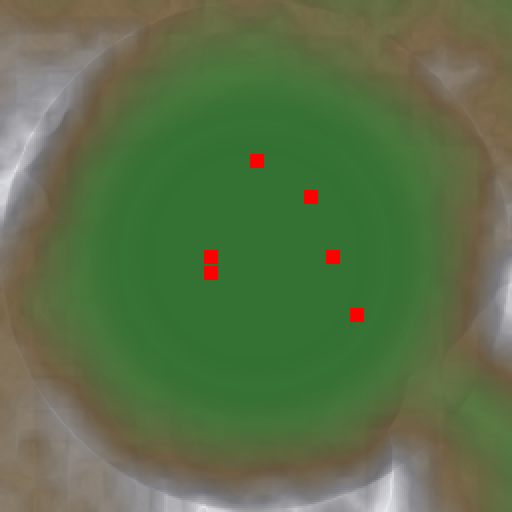

# Analog Strike

A third-person tactical shooter built in **Unreal Engine 5.7**. The premise: rogue robots control every digital system, so the player is a heavily-augmented operative who has to reclaim machine-controlled facilities using *physical* means only — no hacking, no AI assistance, no smart tech.

## Open-World Map

The world is **procedurally generated** — a ~500 m mountain-ringed basin with a central main base, five outlying settlements (forward outpost, ruined town, research station, checkpoint gatehouse, mountain bunker), a lake, and a road network linking everything. Buildings are assembled from a modular kit (walls / floors / doors / windows / columns) at each settlement, with vegetation and rock scatter filling the space between.


The terrain is generated from layered fractal noise + radial mountain rim + ridge noise + flattened building pads:



## What's in the box

**C++ game code (`Source/AnalogStrike/`, 27 classes, ~7 000 lines):**

| Area | Classes |
| --- | --- |
| Core | `ASGameMode`, `ASPlayerController`, `ASHUD`, `ASPlayerCharacter` |
| Weapons | `ASWeaponBase` + 6 weapons (AR / Revolver / Shotgun / Knife / Sniper / Grenade Launcher) handled in the controller |
| Enemies | `ASEnemyBase`, `ASSecurityFrame` (burst-fire), `ASSniper` (charged laser shot), `ASScoutDrone` (flying), `ASBuilderUnit` (repairer), `ASWarden` (boss), `ASEnemySpawner` |
| Hazards / props | `ASExplosiveBarrel`, `ASElectricFence`, `ASSteamVent`, `ASTurret`, `ASPhysicsProp`, `ASControlledDoor`, `ASBreakerBox`, `ASValve` |
| Objectives | `ASRelayNode`, `ASExtractionZone`, `ASNPC`, `ASPickup`, `ASAmmoCrate`, `ASHealStation` |
| World | `ASWeatherSystem` (day/night cycle, sun/sky/fog/rain) |

**Procedural world tools (`tools/procgen/`):**

| File | What it does | Where it runs |
| --- | --- | --- |
| `gen_terrain.py` | Generates the heightmap, walkable terrain mesh (`.obj`), and POI/height data (`.json`) using numpy + PIL | Local Python |
| `ue_import_terrain.py` | Imports the terrain mesh as a static mesh with complex-as-simple collision | Inside UE5 editor |
| `ue_build_map.py` | Reads the POI list, imports Kenney building pieces, and constructs the 6 settlements + roads + 400 vegetation actors | Inside UE5 editor |
| `ue_capture.py` | Spawns a SceneCapture2D at multiple vantage points and exports PNGs | Inside UE5 editor |
| `ue_fix_now.py` | Editor perf fixes (disable Lumen, virtual shadow maps, realtime sky capture, scenery shadows) | Inside UE5 editor |
| `ue_master.py` | Runs import → build → capture in one headless editor session | Headless |

## Gameplay features

- **6 weapons** with distinct feel (auto AR with spin-up, revolver, pump shotgun pellets, 3-hit knife combo, sniper with 12x scope, AoE grenade launcher)
- **Movement systems** — sprint, crouch, dodge, double jump, wall run, grapple hook (T), bullet time (B), ground pound, deployable turrets (X), flashlight (F)
- **Enemy AI** — flanking, cover-seeking when low HP, alert-on-hit, enemy shields (broken by sustained fire), stagger on heavy hits
- **RPG layer** — stamina, XP/levels (kills grant XP, levels boost max HP), weapon damage upgrades every 10 kills
- **HUD** — health/stamina/shield/XP bars, minimap with rotating enemy dots, objective waypoint, directional damage indicators, kill feed, kill-streak callouts, threat counter, NPC dialogue box, mission timer, dynamic crosshair with spread, sniper scope overlay, pause menu with stats, end-of-mission grade screen

## Building it

Open `AnalogStrike.uproject` in **UE 5.7** (or right-click → Generate Project Files, then build). The C++ compiles into the editor module.

## Running the procedural map

```bash
# 1. Generate the terrain locally (creates ~/Downloads/as_terrain.obj + heightmap + JSON)
python3 tools/procgen/gen_terrain.py

# 2. In the UE5 editor, Tools -> Execute Python Script... and run:
#    tools/procgen/ue_import_terrain.py
#    tools/procgen/ue_build_map.py
#    tools/procgen/ue_capture.py     (optional — renders preview PNGs)
```

The build script reads the Kenney modular building kit from `~/Downloads/kenney_models/`. Grab the [prototype kit](https://kenney.nl/assets/prototype-kit) and [tower defense kit](https://kenney.nl/assets/tower-defense-kit) (both CC0).

## License

Game code: MIT. Kenney art assets used during development are CC0 and are not redistributed in this repo — fetch them yourself from kenney.nl.
